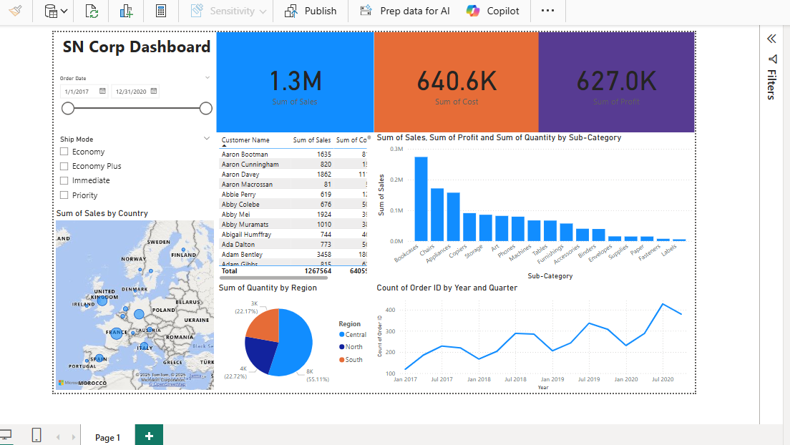

# 📊 Power BI Sales Insight Dashboard — Aug 2024 Workshop

This project showcases an interactive sales dashboard built during a 2-day Power BI workshop held on **August 3–4, 2024**. The dashboard visualizes key business metrics such as revenue, product-wise performance, and regional trends using slicers, filters, KPIs, and dynamic visuals.

---

## 📅 Workshop Overview

- **Title:** Power BI Hands-on Workshop  
- **Dates:** August 3–4, 2024  
- **Trainer/Platform:** 🟢 (Jatan Shah)  
- **Certificate:** [View Certificate PDF](docs/Certificate_PowerBI.pdf)

---

## 🧾 Dataset Details

- **File:** `Power BI Dataset.xlsx`
- **Source:** Provided during the workshop
- **Contents:**
  - Transaction date
  - Region and state
  - Product categories and names
  - Units sold, revenue, and profit
  - Customer type and segment

📝 Note: The dataset is used solely for learning and demonstration purposes.

---

## 🛠️ Features & Visualizations

| Feature                            | Description                                |
|-----------------------------------|--------------------------------------------|
| 📌 KPI Cards                      | Revenue, Profit, Units Sold                |
| 🌍 Region-wise Analysis           | Maps or bar charts by region/state         |
| 🕒 Time-based Trends              | Line charts with dynamic date filters      |
| 🎯 Product Performance            | Category vs. profit/revenue comparisons    |
| 🎛️ Interactive Slicers          | Filter by region, product, date, customer  |
| 📊 Drillthrough Capabilities     | Click-through to detailed breakdowns       |

---

## 📂 Project Structure
powerbi-workshop-2024/
├─ dashboard/
│ ├─ SalesInsight.pbix # Power BI dashboard file
│ ├─ overview.png # Full screenshot
├─ data/
│ └─ Power BI Dataset.xlsx # Excel data used in the dashboard
├─ docs/
│ └─ Certificate_PowerBI.pdf # Workshop certificate
├─ README.md

